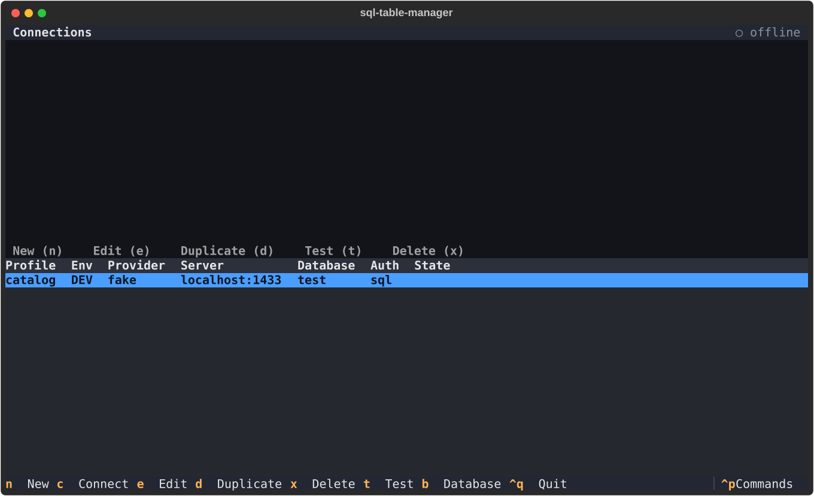
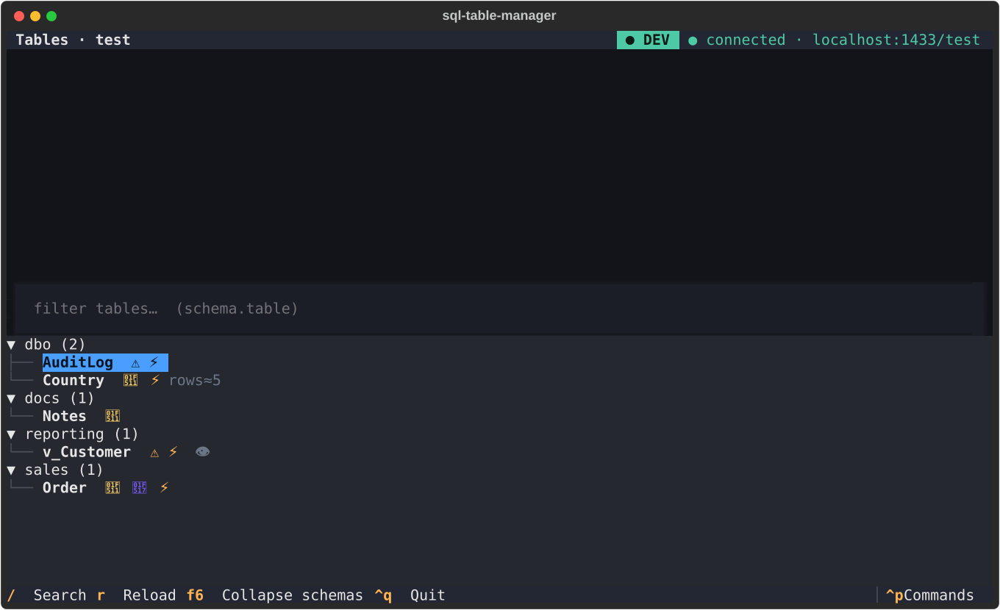
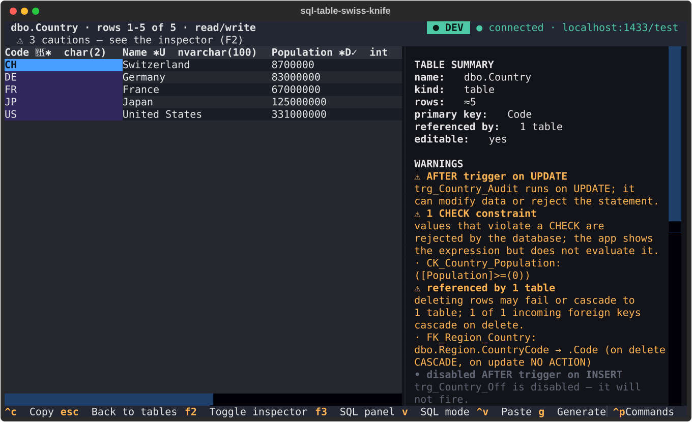
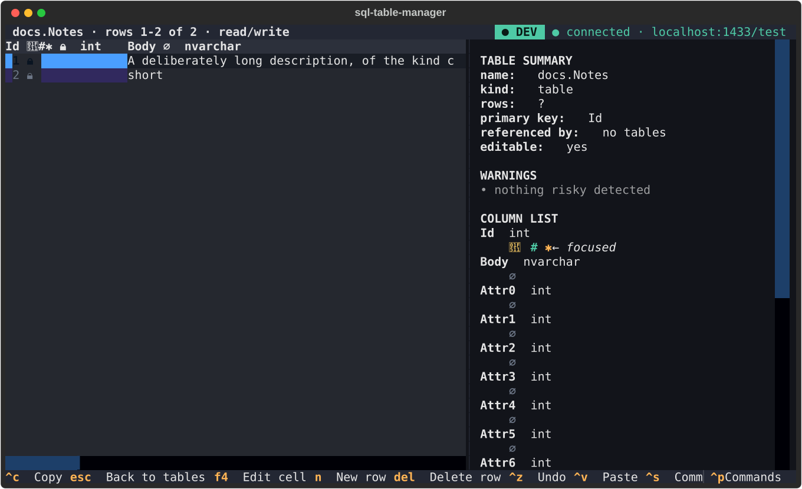
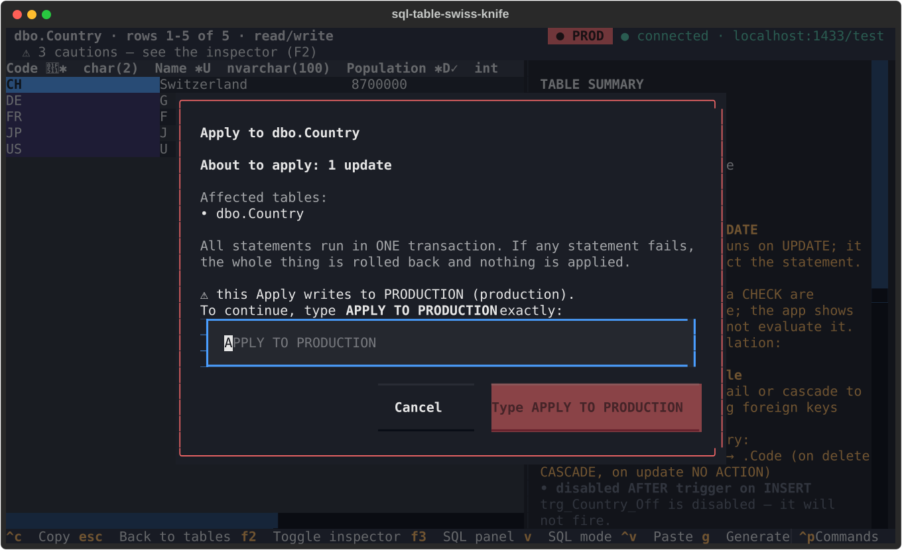
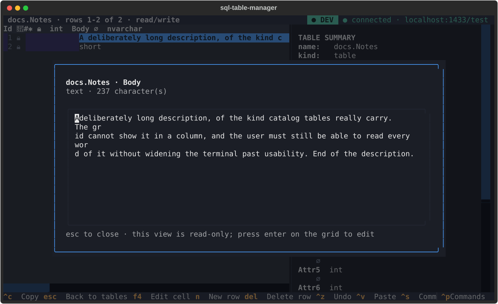
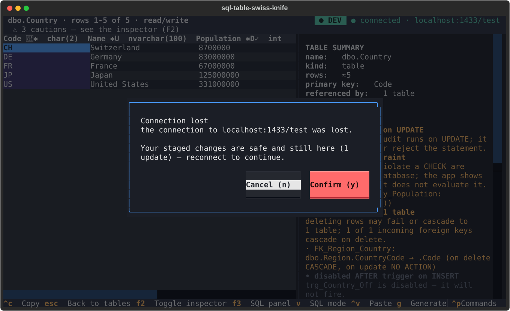
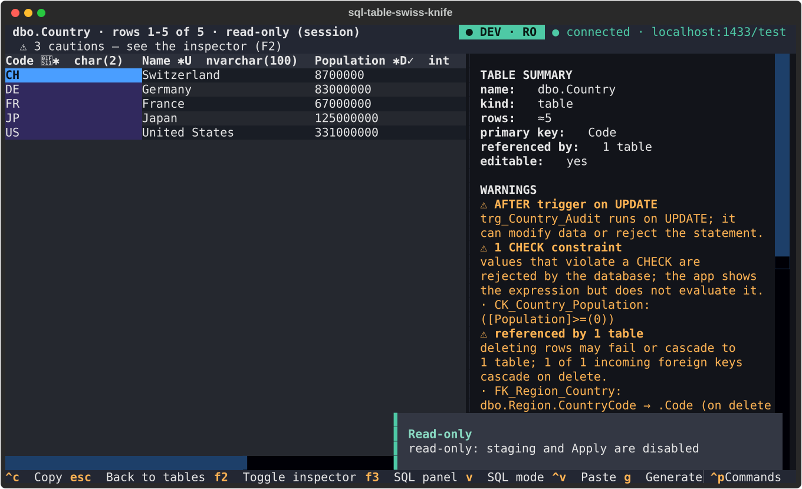
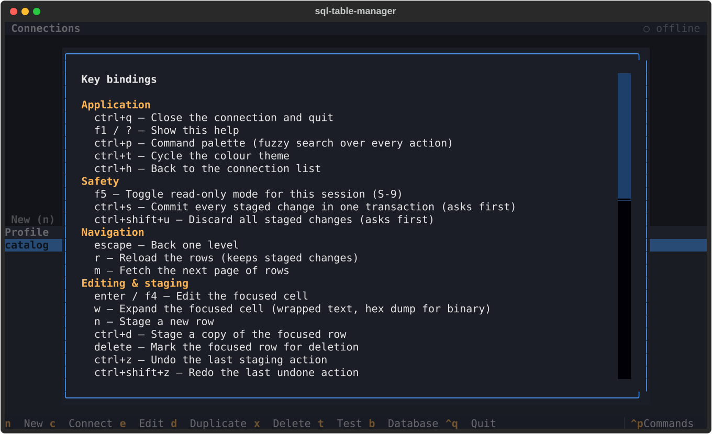

# sql-table-swiss-knife

**Edit catalog tables without writing SQL — and always see the SQL it runs.**

A Python 3.14 terminal (TUI) application for **viewing and editing rows of database tables
that have no CRUD UI** — status codes, type lists, parameter tables, feature flags. It
stages edits in memory, shows the exact SQL they will run (parameterized and copy-ready
literal), and applies them in a single transaction. First target DBMS: Microsoft SQL Server.

**English** · [Español](README.es.md)

[](https://www.python.org/downloads/)
[](https://textual.textualize.io/)
[](https://learn.microsoft.com/sql/sql-server/)
[](LICENSE)
[](PROGRESS.md)

### Who this is for

If you maintain one of those tables today, you probably open `psql` or `sqlcmd` and type an
`UPDATE` by hand — or you don't, and the table quietly drifts. This is the tool for
maintaining it without the SQL.

It is **not** a database IDE. There is no free-form SQL console, no DDL, no schema
designer, no ORM. If you want those, use your database's own tooling — this is
deliberately the small thing.

### What it does

- **Edits are staged, never immediate.** Nothing reaches the database until you Apply, and
  Apply runs everything in one transaction — all of it, or none of it.
- **The SQL is always on screen** (`F3`), both as sent and as a copy-ready literal script.
  This is the point of the tool: you don't have to *write* SQL, but you can always *read*
  it — and copy the script for a DBA to run out-of-band.
- **Safe by default.** Read-only is on by default for production profiles; a red `PROD`
  badge in the header; the Apply dialog states the counts and the affected tables and
  demands a typed word against production; every Apply — committed, rolled back or
  refused — is recorded in a local audit log.
- **It refuses rather than guesses.** A table with no primary key is read-only, because an
  `UPDATE` without a key is `WHERE 1=1` by accident.
- **Awkward data is expected.** Wide tables scroll with the key column frozen; long text
  opens full-screen; binary shows a hex dump; a dropped connection tells you your staged
  work is safe instead of losing it.

> This project is managed with [**uv**](https://docs.astral.sh/uv/) — `uv sync`,
> `uv add`, `uv run`. Do not `pip install` into the venv; there is no `requirements.txt`.

Status: **Milestone 8 — hardening & release.** Staged edits with a live SQL preview,
clipboard import/export, safety layer, wide/long/binary cell handling, a reconnect prompt
that keeps your staged work, an `F1` help screen, and packaging. See
[PROGRESS.md](PROGRESS.md) for the full status, [SPEC.md](SPEC.md) / [DESIGN.md](DESIGN.md)
for requirements and design, [docs/ARCHITECTURE.md](docs/ARCHITECTURE.md) for the layering
and [docs/ADDING_A_PROVIDER.md](docs/ADDING_A_PROVIDER.md) to support another DBMS.

## Screens

Every image below is a **Textual SVG snapshot** of a real screen, exported straight from
`tests/tui/__snapshots__/`. They are generated by the test suite, so they cannot drift
from the code without a test failing.

**Connection profiles** — the environment of each profile is visible before you connect.



**Table browser** — schema tree with the glyph badges: `🔑` primary key, `🔗` foreign
keys, `⚡` triggers, `⚠` **no** primary key (read-only), `👁` view.



**The workspace** — data grid, inspector and (with `F3`) the SQL panel. Note the
frozen key column and the column badges: type, `🔒` read-only, `✱` updated, `∅` nullable.



**Wide tables** scroll horizontally with the identity column frozen in place.



**Apply against production** — red border, the counts, the affected tables, the
transaction guarantee, and a word that must be typed.



**Cell expand view** — a long text cell in full, hard-wrapped and read-only.



**Connection lost** — the prompt that says your staged changes are safe.



**Read-only session** — the badge carries `RO` and the write hints are gone.



**`F1` help** — every keybinding, grouped, with the safety summary.



## Install

```bash
git clone https://github.com/Chienwei82/sql-table-helper.git
cd sql-table-helper
uv sync
uv run sql-table-swiss-knife
```

Requires Python 3.14. To connect you also need an **ODBC driver manager** and the
**Microsoft ODBC Driver 18** (17 works too) — on Linux, `unixODBC` plus the driver.

**Behind a corporate proxy?** `uv` does its own TLS, so a proxy that intercepts with a
private CA fails `uv sync` in a way `pip` would not. See
[docs/CORPORATE_PROXY.md](docs/CORPORATE_PROXY.md), and the `uv pip` route below.

> The package is **not published on PyPI yet**, so the `uv tool install
> sql-table-swiss-knife` line that used to sit here does not work. Install from a
> checkout, or build a wheel with `uv build` and install the result.

### Installing with `uv pip` instead of `uv sync`

Useful behind a corporate mirror, where a lockfile pinning exact versions is more
likely to be a problem than a help:

```bash
uv venv                                  # create the environment first
source .venv/bin/activate                # Windows: .venv\Scripts\activate
uv pip install -e .                      # runtime only
uv pip install -e . --group dev          # + pytest, ruff, mypy, import-linter
uv pip install -e ".[clipboard]"         # + the better clipboard backend
sql-table-swiss-knife                    # or the short alias: stsk
```

Two things to know, both of which will bite you otherwise:

- **`--group dev` is not implied.** Without it you get the six runtime dependencies and
  no test or lint tooling at all — `pytest` is simply absent, not merely out of date.
- **Activate the venv; do not use `uv run`.** Inside an activated venv `uv run` leaves
  your environment alone. Outside it, `uv run` re-syncs from `uv.lock` first and will
  uninstall whatever `uv pip` installed that the lock does not mention. To freeze what
  you resolved, export it rather than committing it (`requirements.txt` is deliberately
  not part of this project):

  ```bash
  uv export --no-hashes --format requirements-txt > /tmp/requirements.txt
  ```

Neither route installs the ODBC driver — that is a system package, not a Python one.

A **single-file** build is also supported for locked-down machines and for dropping the
app onto a server without touching its Python:

```bash
uv run scripts/build_standalone.py        # writes dist/sql-table-swiss-knife (one file)
```

It uses [PyInstaller](https://pyinstaller.org) (declared as the optional `standalone`
extra) and is **not** built or tested on CI — the frozen binary is platform-specific and
the test suite does not cover it. See [Known limitations](#known-limitations).

## Development

```bash
uv sync                     # install runtime + dev deps (Python 3.14)
uv run pytest               # unit + provider + TUI tests (live tests skip themselves)
uv run pytest -m live       # integration tests (need the docker server, see below)
uv run ruff check .         # lint
uv run ruff format --check .  # format check
uv run mypy                 # strict type check
uv run sql-table-swiss-knife --version
uv run sql-table-swiss-knife   # launch the TUI (quit: ctrl+q)
```

## Using the TUI

| Key | Where | Action |
|---|---|---|
| `n` / `e` / `d` / `x` | connections | new / edit / duplicate / delete a profile |
| `t` | connections | test the profile (no session left behind) |
| `enter` | connections | connect — the database picker appears if the profile has no default |
| `b` | connections | switch database on the live session |
| `/` | tables | search-as-you-type over `schema.table` |
| `f6` | tables | collapse/expand the schema groups |
| `enter` | tables | open the selected table (grid + inspector) |
| `f2` | table | show/hide the inspector panel |
| `f3` | table | show/hide the **SQL panel** (F3) |
| `v` | table | cycle the SQL rendering: parameterized → literal → script |
| `y` | table | copy the SQL — the whole script, or the selected statement |
| `ctrl+c` | table | copy the cell / row / column / selection as the current format |
| `b` | table | cycle the copy scope: cell → row → column → selection |
| `p` | table | cycle the copy format TSV → CSV → JSON (remembered in settings.toml) |
| `ctrl+v` | table | paste (terminal bracketed paste is the primary path) |
| `i` / `o` | table | import a CSV/JSON file / export the rows on screen |
| `g` | table | "generate SQL for…" this row or the current filter |
| `m` | table | fetch the next page of rows (1000-row default page) |
| `r` | table | reload metadata and rows |
| arrows / `enter` | table | move the cell cursor (the inspector follows) / explain the cell |
| `ctrl+p` | anywhere | command palette (fuzzy search over the current screen's actions) |
| `f1` (or `?`) | anywhere | the help screen: every keybinding, grouped |
| `f5` | table | toggle read-only mode for this session |
| `ctrl+s` | table | apply every staged change (behind the confirmation) |
| `w` | table | **expand** the focused cell — full text, or a hex dump for binary |
| `ctrl+t` | anywhere | cycle the theme (persisted in `settings.toml`) |
| `esc` | anywhere | back one level |
| `ctrl+q` | anywhere | quit (the connection is closed first) |

The full, authoritative list is in the application itself: press `F1`. The table above
is a convenience, and `tests/unit/tui/test_keybindings.py` fails if the two drift apart.

### Rebinding the keys

An empty `keybindings.toml` template is written to the config directory on first run.
Print the path with `--print-config-dir`, edit the file, restart:

```bash
uv run sql-table-swiss-knife --print-config-dir
# → /home/you/.config/sql-table-swiss-knife
```

```toml
[keys]
apply = "ctrl+g"          # instead of ctrl+s
help  = "f2"              # instead of f1
```

Unknown action names, non-string values and malformed TOML are **reported as warnings on
the status line** and the defaults are kept — an optional preferences file must never
stop the app from starting.


Table rows carry glyph badges that survive every theme and colour-vision difference:
`🔑` has a primary key, `🔗` has foreign keys, `⚡` has triggers, `⚠` has **no** primary
key (rows are read-only, S-4) and `👁` is a view.

The same convention runs through the table workspace:

- **Grid headers** show the column name, its badges and the exact type — e.g.
  `Code 🔑✱ char(2)`. `🔒` marks a read-only column (identity, computed, rowversion).
- **The inspector panel** (`F2`) has four sections: TABLE SUMMARY (schema.name, rows, PK,
  "referenced by N tables"), a WARNINGS banner coloured by severity (`⛔` / `⚠` / `•`,
  disabled triggers dimmed), the COLUMN LIST with per-column badges
  (`🔑` PK with its ordinal in a composite key, `🔗` FK → target, `#` identity, `ƒ` computed,
  `⏱` rowversion, `∅` nullable / `✱` required, `D` default, `U` unique, `✓` check) and the
  COLUMN DETAIL of the focused column (exact type, nullability, default expression,
  identity seed/increment, computed definition, check text, unique index names, FK
  referential actions, collation).
- **Risk first.** An `INSTEAD OF` trigger says your INSERT/UPDATE/DELETE may not do what
  you expect; a table without a key says row identity is ambiguous; incoming foreign keys
  say deleting rows may fail or cascade, with the referential actions spelled out. CHECK and
  UNIQUE risks are marked "will be verified by the database" — the app never evaluates them
  itself.

## Copy & paste

**Copy** puts the cell, the whole row, the whole column or the selected rectangle on the
clipboard as TSV (default — pastes straight into Excel and Sheets), CSV (RFC 4180 quoting)
or JSON, with `NULL` written as empty text or as the literal word (`copy_null_repr`). The
scope is explicit (`b`) because "copy this row" and "copy the INSERT for this row" are
different requests and neither should be guessed at.

The mechanism is a chain: **pyperclip** if the optional extra is installed, otherwise the
platform's own command (`pbcopy`, `wl-copy`/`xclip`/`xsel`, `clip.exe`), and finally the
**OSC 52** escape sequence — which is what keeps copying working over SSH and inside tmux,
where no system clipboard exists. The status line names the mechanism that took the text,
and a failed copy is reported rather than assumed.

**Paste** is read from the terminal's *bracketed paste*, so a block copied from Excel
arrives intact as one event. It is parsed (BOM/CRLF normalized, RFC 4180 quoting so a cell
may contain tabs and newlines, JSON arrays of objects accepted) and then **planned**:

- **one value** → the focused cell, newlines and all;
- **a rectangular block over a selection** → that selection, one value filling all of it;
- **anything with several rows** → rows: `UPDATE` where the primary key matches a loaded
  row, `INSERT` where it does not.

A **Paste Preview** dialog then shows the column mapping (by header name when the block
carries one, positional otherwise), the converted value next to the pasted text
(`31.01.2026 → 2026-01-31`, `1.234,56 → 1234.56`), the UPDATE/INSERT split and every
per-cell validation error. **Nothing is staged until that dialog is confirmed**, and a plan
with a single bad cell is refused outright — there is no "paste the valid rows only".

Import from and export to **CSV/JSON files** go through exactly the same parser, converter
and preview, so a file can never be validated differently from a paste — and an import never
writes to the database.

The knobs live in `settings.toml`:

```toml
copy_format = "tsv"                # tsv | csv | json
copy_null_repr = ""                # what NULL is copied as
paste_null_token = "NULL"          # what means SQL NULL on paste ("" disables it)
paste_null_as_literal = false      # true: the word "NULL" is pasted as text
paste_number_locale = "en"         # en (1,234.56) | de (1.234,56)
paste_date_format = "iso"          # iso | dmy | mdy
paste_max_rows = 5000              # refuse a bigger block instead of staging it
clipboard_read_fallback = false    # allow ctrl+v to read the system clipboard
```

## Safety

A tool that writes to a database needs to be *boring* about it. Every rule below exists
because the alternative is a plausible mistake against real data.

### Read-only per profile, defaulting ON for production

Each profile declares an **environment** and a read-only flag:

```toml
[[profile]]
name = "prod-erp"
environment = "production"   # development | test | staging | production
read_only = true             # optional; omit it and the environment decides
```

Omit `read_only` and the environment decides: **production opens read-only**, everything
else opens writable. A production profile that can write by accident is the failure this
exists to prevent, so the safe answer is the default and turning writing on is always an
explicit, visible act. `f5` toggles it for the session; the badge follows immediately.
`sql-table-swiss-knife --read-only` forces read-only for the whole process and **locks the
toggle** — a read-only session you cannot accidentally leave.

Read-only is enforced at the *staging* boundary, not at Apply: edits are refused where
they would have been made, so a read-only session never accumulates work it will not be
allowed to commit.

### The environment badge

The header carries a big coloured pill — red `PROD`, amber `STAGING`, blue `TEST`, green
`DEV` — plus `RO` when the session is read-only. It is a word and not only a colour,
because "which database am I in" and "may I write" are two different questions and
colour alone answers neither reliably.

The badge is driven by the *same* `SafetyPolicy` object that gates the write. A badge
reading `DEV` while the Apply dialog demands a production word would be worse than no
badge, so the two are structurally incapable of disagreeing — and a test pins it.

### The Apply confirmation

`ctrl+s` never writes directly. The dialog states what is about to happen:

- the **counts** by kind — `About to apply: 1 insert, 2 updates, 0 deletes`;
- the **affected tables** — a count alone does not tell you *which* table you are about to
  change;
- the **transaction guarantee** — all statements run in one transaction, and any failure
  rolls the whole thing back;
- for **production** (and for large delete batches), a **typed confirmation**: the button
  stays disabled until you type the exact word. `y` and `enter` both re-check it, so the
  prompt cannot be shortcut.

### Refusals

| Refused | Why | Override |
|---|---|---|
| editing a table with **no primary key** | an `UPDATE`/`DELETE` without a key is `WHERE 1=1` by accident | `allow_keyless_writes` in settings |
| `UPDATE`/`DELETE` without key columns staged | the optimistic-concurrency guard has nothing to match on | — |
| writing through a **read-only session** | the profile/environment says so | `f5`, or `--read-only` is final |
| writing to a **view** | it has no updatable columns | — |
| a **server-managed column** (identity, computed, rowversion) | the server owns it | INSERT with identity values, behind a warning |
| a **disabled trigger** on the table | it will not fire, so the change is not what the schema implies | shown as a warning in the inspector |

### The audit log

Every Apply — committed, **rolled back** or **refused** — appends one JSON line to
`audit.log.jsonl` in the config directory:

```json
{"timestamp": "2026-03-04T09:12:33Z", "profile": "prod-erp", "environment": "production",
 "server": "sql01.corp", "database": "ERP", "table": "dbo.Country",
 "counts": {"insert": 0, "update": 1, "delete": 0},
 "statements": ["UPDATE dbo.Country SET [Name] = N'Germany (edited)' WHERE [Code] = N'DE';"],
 "outcome": "committed", "duration_ms": 42}
```

**No passwords, ever** — not the connection password, not a connection string. The
statements are the *literal* rendering, because the point of the record is that somebody
auditing the change six months later can read it without the parameter values. Refused
Applies are logged too: "someone tried to change production at 09:12" is exactly the
event an audit log exists to surface.

## Big, wide and awkward data

The tool is used against the tables nobody gave a UI — which are, by definition, the
awkward ones.

- **Huge tables** are paged (`m` fetches the next 1000 rows; `fetch_limit` in
  `settings.toml`), and no operation ever issues `SELECT *` over the whole table.
- **Wide tables** scroll horizontally, and the identity column stays **frozen** — with a
  hundred columns you still know which row you are looking at.
- **Long text cells** are truncated in the grid with a marker and open **full screen** on
  `w`, hard-wrapped, read-only. The grid stays a grid.
- **Binary cells** show a hex preview in the cell (`0x0102… (8 bytes)`) and a full hex
  dump in the expand view. They are never rendered as mojibake.
- **Connection loss** is a first-class state, not a crash: a dropped link raises a
  **reconnect prompt** that tells you your staged changes are still there. Reconnecting
  drops the dead catalog cache and re-reads the rows; the staging buffer is
  re-attached, so a flaky network cannot cost you an afternoon's edits.

The cell-type decision lives in `services/cellview.py` as plain functions over values, so
"is this cell expandable and how" is unit tested rather than asserted through a widget.

## The SQL panel

`F3` opens a panel under the grid showing the SQL for every pending change, in apply order,
with SQL syntax highlighting. It is the point of the tool: the app exists so you do not have
to *write* SQL, and this is where you can still *see* it.

**Three renderings, one key (`v`).** They are three views of the same statement objects, so
they can never disagree about what the app would do:

| Mode | Shows | Use it to |
|---|---|---|
| **Parameterized** | `UPDATE … SET [Name] = @p0 …` plus a legend (`@p0 = N'Germany'`) | see exactly what is sent to the server |
| **Literal** | the same statement with values inlined and escaped | paste into SSMS, another tool, a ticket |
| **Script** (default) | every statement in `BEGIN TRANSACTION` / `BEGIN TRY … END TRY BEGIN CATCH … END CATCH` / `COMMIT`, with `SET IDENTITY_INSERT` when a script needs it | run the change set by hand, all-or-nothing |

The script rendering is what the panel opens on, because it is the one that is safe to run
without thinking. It sets `XACT_ABORT ON`, rolls back and re-`THROW`s in the `CATCH`, and
guards the rollback with `IF @@TRANCOUNT > 0` so an error *before* the transaction opens
cannot be masked by a second one.

**Copy (`y`).** With no statement selected you get the whole script; with one selected you
get that statement (in parameterized mode, together with its parameter values — a bare
`@p0` is not something you can paste).

**Nothing is executed from here.** The panel is preview-only and says so in its header.
`SET`/`IDENTITY_INSERT` handling and every "generate" action produce *text*; the only thing
in the app that writes is Apply (`ctrl+s`), behind a confirmation.

**"Generate SQL for…" (`g`)** produces a statement for the focused row or for the current
filter, for the cases where you need SQL that is not a pending change:

- `SELECT` / `INSERT` / `UPDATE` / `DELETE` for the focused row;
- `MERGE` — an upsert matched on the primary key, so moving a row between environments
  updates the row that is already there instead of colliding with the key;
- `INSERT script for all rows in this table/filter` — one batched multi-row `INSERT` for
  every loaded row, which is how you move a catalog table to another environment. Computed,
  rowversion and identity columns are left out: the target environment keeps its own.

Only the statements that can be *correct* for the current row are offered, and the reason
for each omission is shown (no key → no `UPDATE`/`DELETE`; no primary key → no `MERGE`).

### Escaping

All of it lives in one place — `SqlDialect.literal()` — and is covered by
`tests/unit/test_dialect_escaping.py`:

- strings → `N'…'` with `'` doubled (the `N` prefix is what survives a non-Unicode
  collation), newlines and control characters kept verbatim;
- `None` → `NULL`, `bool` → `1`/`0`, `bytes` → `0x…`, `Decimal` → plain digits (never
  `1E+3`), dates/times → ISO-8601, `UUID` → its text form;
- an integer outside the `bigint` range and a string containing a NUL are **refused**
  rather than rendered: a literal SQL Server would misread is worse than a clear error.

## Themes

Three built-ins — `default-dark`, `light` and `high-contrast` — switchable at runtime with
`ctrl+t` or from the command palette, and the choice is persisted in `settings.toml`:

```toml
theme = "high-contrast"
fetch_limit = 1000          # other settings from DESIGN §13.2 are read here too
```

Every theme declares the same *semantic* palette (`$pk`, `$fk`, `$identity`, `$computed`,
`$nullable`, `$error`, `$warning`, `$pending`), so the UI never hard-codes a colour.

## Connection profiles

Profiles live in the platformdirs config dir (override with `SWISSKNIFE_CONFIG_DIR`) as
`profiles.toml`. **Passwords are never written to that file** — they live in the OS keyring
(keyring service `sql-table-swiss-knife`, account = `secret_ref`) or are prompted per
session when no keyring backend is available:

```toml
[[profile]]
name = "local"
provider = "mssql"
host = "localhost"
port = 1433
database = "SwissKnifeSample"
auth = "sql"                  # or "integrated" for Windows integrated auth
username = "sa"
secret_ref = "local@localhost"   # keyring account, NOT the password
[profile.options]
encrypt = true
trust_server_certificate = true
driver = "ODBC Driver 18 for SQL Server"
```

A `password`/`pwd` key in this file is rejected at load time.

## Sample SQL Server

A dockerized SQL Server 2022 (Developer) with a catalog-like sample database lives in
`tests/live`:

```bash
cd tests/live
docker compose up -d          # starts SQL Server, then loads init/01_sample_catalog.sql
docker compose down -v        # wipe
```

Connection: `localhost,1433`, user `sa`, password `SwissKnife!2022_Test`
(override with `MSSQL_SA_PASSWORD`), database `SwissKnifeSample`.

Running pyodbc on Linux additionally needs `unixODBC` and the Microsoft ODBC Driver 18.

## `inspect` — verify introspection from the shell

A temporary Milestone-2 command that prints the introspected metadata as Rich tables,
so you can check the `sys.*` layer without launching the TUI:

```bash
uv run sql-table-swiss-knife inspect <profile> dbo.Region     # full metadata
uv run sql-table-swiss-knife inspect <profile> x --list       # tables + row counts
uv run sql-table-swiss-knife inspect <profile> x --databases  # databases
```

It resolves the password from the keyring, prompting if needed. This command is expected
to be reworked or dropped: the TUI inspector shows the same metadata interactively.

## Layout

```
src/sql_table_swiss_knife/
  domain/      pure models — ConnectionProfile, Table, PendingChange, RowKey (no I/O)
  providers/   DatabaseProvider + SqlDialect protocols, shared SQL generation, plugin
               registry, and mssql/ (connection string, error mapping, sys.* metadata)
  storage/     profiles.toml (no secrets), settings.toml, keyring + ephemeral secret
               stores, audit.log.jsonl
  services/    the layer the TUI talks to: connection lifecycle, catalog reads, paging,
               staging, validation, safety policy, SQL preview, cell views, clipboard
  tui/         Textual app: screens/, widgets/, theme.py, keybindings.py, keymap.py
  infra/       clipboard backends and error translation
docs/          ARCHITECTURE.md, ADDING_A_PROVIDER.md, screenshots/ (generated SVGs)
scripts/       build_standalone.py (optional single-file build)
tests/
  unit/        domain, services, providers, storage — no terminal, no database
  tui/         Textual Pilot tests + __snapshots__/ SVG snapshots
  live/        integration against the dockerized SQL Server
```

The layering is enforced at CI time by `import-linter`; a module that reaches across a
layer fails the build rather than a code review.

## Tests and quality gates

```bash
uv run pytest                    # everything; live tests skip themselves
uv run pytest tests/unit -q      # fast: no terminal, no database
uv run pytest --cov=sql_table_swiss_knife --cov-report=term-missing
uv run ruff check . && uv run ruff format --check .
uv run mypy                      # strict, src + tests
```

The layers are tested deliberately unevenly: the decisions (safety, staging, SQL
generation, cell typing, keymap parsing) are covered densely because that is where a bug
is expensive; the widget plumbing is covered through Pilot tests and snapshots, which
catch the failures that actually happen there. Exact counts and coverage live in
[PROGRESS.md](PROGRESS.md).


## Known limitations

Stated plainly, because a list of them is more useful than a claim of completeness:

- **Selection is keyboard-only.** `shift+arrows` works; mouse-drag selection is not wired
  into the grid, so `ctrl+c` with the *selection* scope needs the keyboard.
- **CSV export does not neutralise spreadsheet formula injection.** A cell whose text
  starts with `=`, `+`, `-` or `@` is written verbatim, and the export deliberately adds
  a UTF-8 BOM so Excel opens it as UTF-8 — so a row sourced from an untrusted upstream
  system can execute on open. The output is not escaped, because prefixing such cells
  would corrupt the data this tool exists to move faithfully, and silently rewriting a
  value is a worse surprise than a documented one. Treat an export as trusted-input-only,
  or strip the leading character in the source system.
- **The single-file build is not CI-verified.** PyInstaller output is platform-specific
  and the test suite does not cover it. It also does not bundle unixODBC or the Microsoft
  ODBC driver — those must be installed on the target machine.
- **One DBMS.** SQL Server. The seams for others are real and documented
  ([docs/ADDING_A_PROVIDER.md](docs/ADDING_A_PROVIDER.md)) — SQL text, `LIKE` escaping and
  driver-error classification all sit on `SqlDialect` rather than in `services/` — but no
  second provider has been written against them, so treat that guide as a design, not as a
  proven recipe.
- **The audit log is a local file.** It is append-only by convention only — anybody with
  write access to the config directory can edit it. It is a record of what the tool did,
  not a compliance system.
- **The keybinding drift check covers the built-in screens.** A key rebound by a user is
  validated, not verified against the widgets, so a custom binding can still shadow a
  built-in one.
- **Excel `.xlsx` import is not supported.** CSV and JSON file import are, through the
  same parser and preview as a clipboard paste. `.xlsx` itself is not read — CSV exported
  from Excel works.
- **File-based import/export is built but SPEC §2.2 still lists it as out of scope.** The
  code and the spec disagree; the spec has not been amended yet. Treat the README as
  current.
- **`inspect` is a temporary developer command** and will be reworked or dropped.

## Documentation

| Document | What is in it |
|---|---|
| [README.es.md](README.es.md) | la traducción al español de este documento |
| [SPEC.md](SPEC.md) | requirements (FR/S/NFR identifiers) and the safety rules (S-*) |
| [DESIGN.md](DESIGN.md) | the design decisions behind those requirements |
| [docs/ARCHITECTURE.md](docs/ARCHITECTURE.md) | layering, the safety model, the concurrency story, testing strategy |
| [docs/ADDING_A_PROVIDER.md](docs/ADDING_A_PROVIDER.md) | step-by-step guide to supporting another DBMS |
| [PROGRESS.md](PROGRESS.md) | milestone status, coverage, known gaps |
| [CONTRIBUTING.md](CONTRIBUTING.md) | how to contribute: setup, the five gates, the rules that matter |
| [SECURITY.md](SECURITY.md) | reporting a vulnerability, and what the app does and does not protect |
| [AGENTS.md](AGENTS.md) | **instructions for AI coding agents** working in this repo |

## Using AI coding agents

[AGENTS.md](AGENTS.md) is the authoritative brief for an agent working in this repository:
the architecture, the five quality gates, the rules that are mechanically enforced, and
the conventions. It is a single source of truth that the per-tool files delegate to, so
the rules cannot drift apart:

| File | Tool |
|---|---|
| [AGENTS.md](AGENTS.md) | the brief itself — read this |
| [CLAUDE.md](CLAUDE.md) | Claude Code (imports `AGENTS.md`) |
| [GEMINI.md](GEMINI.md) | Gemini CLI |
| [.cursorrules](.cursorrules) | Cursor |
| [.github/copilot-instructions.md](.github/copilot-instructions.md) | GitHub Copilot |

The short version: `uv` only; run `ruff check`, `ruff format --check`, `mypy`,
`lint-imports` and `pytest` before claiming you are done; never let `services/` import
`tui/`; keep decisions in pure functions; and every fix needs a test that fails without
it.

## License

MIT — see [LICENSE](LICENSE).

This project was written with AI coding assistants (Claude Code and similar). The MIT
license above is the standard, permissive choice and applies to the code as it stands; no
separate "AI" licence is used, because no OSI-approved one exists and inventing a bespoke
licence would only make the code harder to reuse.

On authorship: copyright in AI-assisted work is a genuinely unsettled area of law, and no
licence can resolve it. Practically, what matters is that the licence is a standard one so
that anyone who wants to use this can, and that the copyright line names a real person who
can grant permission. `Copyright (c) 2026 Chienwei82` does both. If you are an
organisation rather than an individual, set the line to your organisation's legal name
before publishing.

